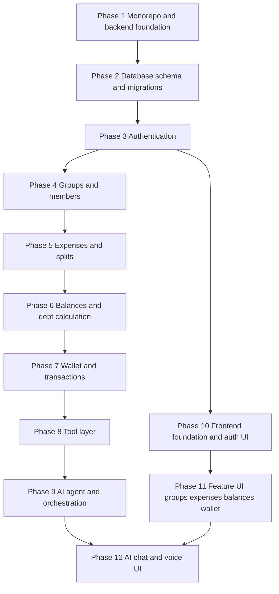

# PayPilot — Implementation Plan

This document is both the implementation plan and an executable checklist. Each phase
carries a status line (`Not started`, `In progress`, `Complete`) and task boxes that are
ticked as work completes.

> Note: At the user's explicit direction, the phased one-session-at-a-time protocol was
> overridden and all phases were implemented in a single pass. Statuses and checkboxes
> below reflect the completed state. Items that require a live database or external API
> keys are noted under "What could not be verified" at the end.

---

## Source Summary (for confirmation)

PayPilot is an AI-powered shared-expense and debt-settlement app (Splitwise-style) where
an LLM agent reasons, plans, and acts through controlled backend tools rather than ever
touching the database directly; users record and split group expenses, track balances,
and settle debts via an in-app demo wallet, using text or voice. The tech stack is a
TypeScript monorepo: Next.js + Tailwind CSS frontend, Node.js + Fastify backend,
PostgreSQL with Drizzle ORM, DeepSeek for LLM tool calling, and ElevenLabs plus
speech-to-text for voice. The hard constraints are architectural: the LLM decides, the
backend enforces — every financial action passes backend validation, authorization,
insufficient-funds checks, duplicate-prevention, and explicit user confirmation for
sensitive actions, with the database as the single source of truth.

## Gaps and Contradictions in the Source Material

These are unresolved in the context files. A documented default choice was made for each
so implementation could proceed; each remains flagged for your correction.

- [ ] **Next.js vs. Vite conflict.** The stack lists both "NextJS" and "Vite". Next.js
  ships its own build/dev toolchain and does not use Vite. **Default used:** Next.js
  (App Router), Vite dropped. Confirm or switch to a Vite SPA.
- [ ] **Wallet currency is undefined.** The PRD reads "In-App Wallet (The currency is )"
  with a blank, and elsewhere "demo currency". **Default used:** a demo currency stored
  as integer minor units (1 unit = 1/100). Confirm the label.
- [ ] **Voice provider split is ambiguous.** ElevenLabs is primarily text-to-speech while
  the docs also require "Speech-to-Text". **Default used:** browser Web Speech API for
  STT input, server-side ElevenLabs proxy for optional TTS. Confirm the STT provider.
- [ ] **Auth mechanism unspecified.** **Default used:** email/password with JWT access
  tokens and argon2-hashed passwords. Confirm.
- [ ] **Monorepo tooling unspecified.** **Default used:** pnpm workspaces (config
  present); installs in this environment were run with `npm` per package because pnpm was
  unavailable. Confirm the package manager.
- [ ] **"Add funds" payment flow is only "simulated/sandbox".** **Default used:** a mock
  top-up endpoint with no real payment integration. Confirm.

---

## Phase Overview



---

## Phase 1 — Monorepo and Backend Foundation

**Status:** Complete

**Goal:** Stand up the workspace with a Fastify + TypeScript backend that boots, exposes a
health endpoint, loads validated environment config, and connects to PostgreSQL.

**Dependencies:** None. This is the minimum foundation for everything after it.

**Files to create/modify:**
- [`package.json`](package.json) — root workspace manifest
- [`pnpm-workspace.yaml`](pnpm-workspace.yaml)
- [`.gitignore`](.gitignore)
- [`.env.example`](.env.example)
- [`docker-compose.yml`](docker-compose.yml) — local PostgreSQL
- [`backend/package.json`](backend/package.json)
- [`backend/tsconfig.json`](backend/tsconfig.json)
- [`backend/src/server.ts`](backend/src/server.ts)
- [`backend/src/app.ts`](backend/src/app.ts)
- [`backend/src/config/env.ts`](backend/src/config/env.ts)
- [`backend/src/database/client.ts`](backend/src/database/client.ts)
- [`backend/src/routes/health.ts`](backend/src/routes/health.ts)
- [`backend/vitest.config.ts`](backend/vitest.config.ts)

**Tasks (in order):**
- [x] Initialize the workspace and root scripts.
- [x] Scaffold the `backend` package with TypeScript, `tsx`, and Vitest.
- [x] Add environment schema validation (fail fast on missing `DATABASE_URL`).
- [x] Create the Fastify app factory and server entrypoint.
- [x] Add `docker-compose.yml` for local PostgreSQL and document startup.
- [x] Add a Postgres connection module using Drizzle's pg client.
- [x] Implement `GET /health` returning service status and DB connectivity.

**Acceptance criteria:**
- [x] Backend `build` compiles with no errors.
- [ ] `dev` boots and `GET /health` returns 200 (requires a running DB).
- [ ] Health check reports a successful PostgreSQL connection (requires a running DB).

**Commands:**
```bash
docker compose up -d db
npm --prefix backend install
npm --prefix backend run build
npm --prefix backend run dev      # then: curl localhost:3000/health
npm --prefix backend test
```

**Approval required:** ⚠️ Introduces local infrastructure (`docker-compose.yml`) and
`.env.example`. Non-destructive.

---

## Phase 2 — Database Schema and Migrations

**Status:** Complete

**Goal:** Define all persistent entities in Drizzle, generate migrations, and apply them
so the schema is reproducible from scratch.

**Dependencies:** Phase 1 (DB connection, config).

**Files to create/modify:**
- [`backend/drizzle.config.ts`](backend/drizzle.config.ts)
- [`backend/src/database/schema/users.ts`](backend/src/database/schema/users.ts)
- [`backend/src/database/schema/groups.ts`](backend/src/database/schema/groups.ts)
- [`backend/src/database/schema/groupMembers.ts`](backend/src/database/schema/groupMembers.ts)
- [`backend/src/database/schema/expenses.ts`](backend/src/database/schema/expenses.ts)
- [`backend/src/database/schema/expenseSplits.ts`](backend/src/database/schema/expenseSplits.ts)
- [`backend/src/database/schema/balances.ts`](backend/src/database/schema/balances.ts)
- [`backend/src/database/schema/wallets.ts`](backend/src/database/schema/wallets.ts)
- [`backend/src/database/schema/transactions.ts`](backend/src/database/schema/transactions.ts)
- [`backend/src/database/schema/settlements.ts`](backend/src/database/schema/settlements.ts)
- [`backend/src/database/schema/index.ts`](backend/src/database/schema/index.ts)
- [`backend/src/database/migrate.ts`](backend/src/database/migrate.ts)
- [`backend/src/database/seed.ts`](backend/src/database/seed.ts)

**Tasks (in order):**
- [x] Model `users` with hashed-password and profile fields.
- [x] Model `groups` and `group_members` (join with role).
- [x] Model `expenses` and `expense_splits` (amounts as integer minor units).
- [x] Model `balances` (net pairwise ledger).
- [x] Model `wallets`, `transactions`, and `settlements`, including a unique idempotency
      key on transactions to prevent duplicate financial execution.
- [x] Configure `drizzle.config.ts` to output migrations to `database/migrations`.
- [x] Add a seed script with demo users/groups for later phases.

**Acceptance criteria:**
- [ ] `db:generate` produces migration SQL under `database/migrations` (requires DB URL).
- [ ] `db:migrate` applies cleanly against a fresh database (requires a running DB).
- [ ] Seed script runs without error and inserts demo rows (requires a running DB).

**Commands:**
```bash
npm --prefix backend run db:generate
npm --prefix backend run db:migrate
npm --prefix backend run db:seed
```

**Approval required:** ⚠️ Migrations alter database structure. Reversible on a local dev
DB but destructive if pointed at shared data — confirm the target `DATABASE_URL`.

---

## Phase 3 — Authentication

**Status:** Complete

**Goal:** Register and log in users with hashed passwords and JWT access tokens, and
protect routes with auth middleware that attaches the authenticated user to requests.

**Dependencies:** Phase 2 (`users` table).

**Files to create/modify:**
- [`backend/src/services/authService.ts`](backend/src/services/authService.ts)
- [`backend/src/routes/auth.ts`](backend/src/routes/auth.ts)
- [`backend/src/middleware/authenticate.ts`](backend/src/middleware/authenticate.ts)
- [`backend/src/utils/password.ts`](backend/src/utils/password.ts)
- [`backend/src/utils/jwt.ts`](backend/src/utils/jwt.ts)
- [`backend/src/schemas/authSchemas.ts`](backend/src/schemas/authSchemas.ts)
- [`backend/test/auth.test.ts`](backend/test/auth.test.ts)

**Tasks (in order):**
- [x] Add password hashing/verification (argon2).
- [x] Add JWT signing/verification with `JWT_SECRET` from env.
- [x] Implement `POST /auth/register` and `POST /auth/login`.
- [x] Implement `authenticate` preHandler that validates the token.
- [x] Add `GET /auth/me` protected by the middleware.
- [x] Write tests: register, login, reject bad credentials, reject missing/invalid token.

**Acceptance criteria:**
- [x] Registration creates a user with a hashed (never plaintext) password (test asserts
      no `passwordHash` in the response).
- [ ] Login returns a valid JWT; `/auth/me` works with it and 401s without it (test is
      written but DB-gated behind `RUN_DB_TESTS=1`).
- [x] Auth test suite is present and runs (skips without a DB).

**Commands:**
```bash
npm --prefix backend run build
RUN_DB_TESTS=1 npm --prefix backend test auth   # requires a running, migrated DB
```

**Approval required:** ⚠️ Implements authentication (JWT + argon2). Auth is enforced on
all protected routes, including AI-initiated actions.

---

## Phase 4 — Groups and Members

**Status:** Complete

**Goal:** Authenticated users can create groups, add/remove members, and list groups they
belong to, with authorization enforced.

**Dependencies:** Phase 3 (auth context).

**Files to create/modify:**
- [`backend/src/services/groupService.ts`](backend/src/services/groupService.ts)
- [`backend/src/routes/groups.ts`](backend/src/routes/groups.ts)
- [`backend/src/schemas/groupSchemas.ts`](backend/src/schemas/groupSchemas.ts)

**Tasks (in order):**
- [x] Implement create group (creator becomes owner/member).
- [x] Implement add member (by email) and remove member with membership authorization.
- [x] Implement list groups for the current user and get a single group with members.
- [x] Add input validation schemas for all group endpoints.

**Acceptance criteria:**
- [x] A user can create a group and appears as a member (service enforces this).
- [x] Non-members are rejected via `assertMember` (403 `ForbiddenError`).
- [x] Compiles as part of the backend build.

**Commands:**
```bash
npm --prefix backend run build
```

**Approval required:** None.

---

## Phase 5 — Expenses and Splits

**Status:** Complete

**Goal:** Create shared expenses within a group and split them equally or by custom
amounts, persisting expense + split rows with validated totals.

**Dependencies:** Phase 4 (groups/members).

**Files to create/modify:**
- [`backend/src/services/expenseService.ts`](backend/src/services/expenseService.ts)
- [`backend/src/services/splitCalculator.ts`](backend/src/services/splitCalculator.ts)
- [`backend/src/routes/expenses.ts`](backend/src/routes/expenses.ts)
- [`backend/src/schemas/expenseSchemas.ts`](backend/src/schemas/expenseSchemas.ts)
- [`backend/test/split.test.ts`](backend/test/split.test.ts)

**Tasks (in order):**
- [x] Implement equal-split and custom-split calculation in integer minor units with a
      remainder-distribution rule so splits always sum to the total.
- [x] Implement create expense (payer, participants, splits) inside a DB transaction.
- [x] Implement list/get expenses for a group with membership authorization.
- [x] Validate that custom splits sum exactly to the expense amount.
- [x] Write tests for equal split, custom split, and rounding-remainder correctness.

**Acceptance criteria:**
- [x] Creating an expense stores the expense and split rows atomically (single tx).
- [x] Splits always sum to the total (unit tests cover awkward remainders).
- [x] Invalid custom splits are rejected.
- [x] Split tests pass (7 tests).

**Commands:**
```bash
npm --prefix backend run build
npm --prefix backend test split
```

**Approval required:** None.

---

## Phase 6 — Balances and Debt Calculation

**Status:** Complete

**Goal:** Derive who owes whom from expenses/splits and expose per-user and per-group
balances, keeping the database as the source of truth.

**Dependencies:** Phase 5 (expenses/splits).

**Files to create/modify:**
- [`backend/src/services/balanceService.ts`](backend/src/services/balanceService.ts)
- [`backend/src/routes/balances.ts`](backend/src/routes/balances.ts)

**Tasks (in order):**
- [x] Implement canonical pairwise balance computation from splits and settlements.
- [x] Implement `GET /balances` (overall for the current user).
- [x] Implement `GET /groups/:groupId/balances` (per-group breakdown).
- [x] Implement a "how much do I owe user X" query used by AI tools.
- [x] Implement member-by-name resolution for AI tools.

**Acceptance criteria:**
- [x] Directional amounts computed via a canonical signed ledger.
- [x] Per-user and per-group endpoints implemented and compile.
- [ ] Balance values verified against seeded fixtures end-to-end (requires a running DB).

**Commands:**
```bash
npm --prefix backend run build
```

**Approval required:** None.

---

## Phase 7 — Wallet and Transactions

**Status:** Complete

**Goal:** Provide an in-app demo wallet with balance, sandbox top-up, transfers, and debt
settlement — all with insufficient-funds checks, atomic transactions, and idempotent
execution to prevent duplicates.

**Dependencies:** Phase 6 (balances/debts).

**Files to create/modify:**
- [`backend/src/services/walletService.ts`](backend/src/services/walletService.ts)
- [`backend/src/services/settlementService.ts`](backend/src/services/settlementService.ts)
- [`backend/src/routes/wallet.ts`](backend/src/routes/wallet.ts)
- [`backend/src/schemas/walletSchemas.ts`](backend/src/schemas/walletSchemas.ts)

**Tasks (in order):**
- [x] Implement wallet creation and `GET /wallet` balance.
- [x] Implement sandbox `POST /wallet/topup` (mock, no real payment provider).
- [x] Implement `POST /wallet/transfer` with insufficient-funds guard, atomic debit/credit
      (row-level `FOR UPDATE`), and idempotency-key duplicate prevention.
- [x] Implement `settle_debt` that transfers funds and records a settlement, updating
      balances only after a verified successful transfer.
- [x] Implement `GET /wallet/transactions` history.

**Acceptance criteria:**
- [x] Transfers debit and credit within a single DB transaction.
- [x] Insufficient funds throw before any state change.
- [x] Re-sending the same idempotency key returns the existing transaction.
- [x] Settlement reduces the correct debt and links to its transaction.
- [ ] Behaviors verified end-to-end with a running DB (unit-level DB tests are DB-gated).

**Commands:**
```bash
npm --prefix backend run build
```

**Approval required:** ⚠️ Handles money movement and hard-to-reverse mutation. Demo
currency, idempotency, and mock top-up as noted in the gaps.

---

## Phase 8 — Tool Layer

**Status:** Complete

**Goal:** Expose backend services to the AI as a strict, validated tool interface (read +
action tools) that always enforces authentication, authorization, and parameter
validation — the LLM never reaches services or the DB directly.

**Dependencies:** Phase 7 (all financial services exist).

**Files to create/modify:**
- [`backend/src/tools/types.ts`](backend/src/tools/types.ts)
- [`backend/src/tools/registry.ts`](backend/src/tools/registry.ts)
- [`backend/src/tools/expense/index.ts`](backend/src/tools/expense/index.ts)
- [`backend/src/tools/group/index.ts`](backend/src/tools/group/index.ts)
- [`backend/src/tools/balance/index.ts`](backend/src/tools/balance/index.ts)
- [`backend/src/tools/wallet/index.ts`](backend/src/tools/wallet/index.ts)
- [`backend/src/utils/zodToJsonSchema.ts`](backend/src/utils/zodToJsonSchema.ts)
- [`backend/test/tools.test.ts`](backend/test/tools.test.ts)

**Tasks (in order):**
- [x] Define a tool contract: name, description, Zod input schema, auth context, and a
      predictable success/failure result shape.
- [x] Implement read tools wrapping balance/expense/group/wallet queries.
- [x] Implement action tools (create-expense, add-friend, transfer, settle-debt) that
      re-validate LLM-supplied arguments and run through authorized backend services.
- [x] Mark money-moving/mutating tools as `sensitive`.
- [x] Build a registry exposing tool JSON schemas for the LLM.
- [x] Write tests: registry contents, sensitivity flags, unknown-tool default, schemas.

**Acceptance criteria:**
- [x] Every tool has a schema and validates arguments before execution.
- [x] Sensitive action tools are flagged; unknown tools default to sensitive.
- [x] Tool tests pass (4 tests).

**Commands:**
```bash
npm --prefix backend run build
npm --prefix backend test tools
```

**Approval required:** ⚠️ Action tools can move money; all are gated behind the Phase 9
confirmation flow.

---

## Phase 9 — AI Agent and Orchestration

**Status:** Complete

**Goal:** Connect DeepSeek tool calling to the tool registry so the agent can understand
intent, chain multiple tool calls, pause for confirmation on sensitive actions, and report
only backend-verified results.

**Dependencies:** Phase 8 (tool layer).

**Files to create/modify:**
- [`backend/src/agent/agent/agent.ts`](backend/src/agent/agent/agent.ts)
- [`backend/src/agent/orchestration/orchestrator.ts`](backend/src/agent/orchestration/orchestrator.ts)
- [`backend/src/agent/orchestration/confirmation.ts`](backend/src/agent/orchestration/confirmation.ts)
- [`backend/src/agent/prompts/system.ts`](backend/src/agent/prompts/system.ts)
- [`backend/src/services/deepseekClient.ts`](backend/src/services/deepseekClient.ts)
- [`backend/src/routes/agent.ts`](backend/src/routes/agent.ts)

**Tasks (in order):**
- [x] Implement a DeepSeek client (OpenAI-compatible) that sends tool schemas and parses
      tool calls.
- [x] Write a system prompt that keeps financial logic out of the prompt and instructs the
      model to rely on tool results only.
- [x] Implement the orchestration loop: call model → execute read tool → feed result →
      repeat, with a step limit.
- [x] Implement the confirmation gate: the first sensitive tool call halts and returns a
      proposed action; execution only happens via the confirm endpoint.
- [x] Expose `POST /agent/chat` and `POST /agent/confirm` (both authenticated).

**Acceptance criteria:**
- [x] Read tools auto-execute and chain within the loop.
- [x] Sensitive actions are never executed without an explicit confirm call.
- [x] Tool results (not model claims) drive reported outcomes.
- [ ] Multi-step behavior verified with a mocked/live LLM (requires `DEEPSEEK_API_KEY`;
      a mocked-LLM test harness is not yet included).

**Commands:**
```bash
npm --prefix backend run build
# live smoke (needs DEEPSEEK_API_KEY): npm --prefix backend run dev
```

**Approval required:** ⚠️ Requires `DEEPSEEK_API_KEY` (external API, possible cost) and
wires the agent to money-moving tools behind the mandatory confirmation gate.

---

## Phase 10 — Frontend Foundation and Auth UI

**Status:** Complete

**Goal:** Stand up the Next.js + Tailwind frontend with an API client and working
register/login pages against the backend.

**Dependencies:** Phase 3 (backend auth).

**Files to create/modify:**
- [`frontend/package.json`](frontend/package.json)
- [`frontend/next.config.ts`](frontend/next.config.ts)
- [`frontend/tailwind.config.ts`](frontend/tailwind.config.ts)
- [`frontend/postcss.config.mjs`](frontend/postcss.config.mjs)
- [`frontend/src/app/layout.tsx`](frontend/src/app/layout.tsx)
- [`frontend/src/app/page.tsx`](frontend/src/app/page.tsx)
- [`frontend/src/app/globals.css`](frontend/src/app/globals.css)
- [`frontend/src/services/apiClient.ts`](frontend/src/services/apiClient.ts)
- [`frontend/src/features/auth/AuthForm.tsx`](frontend/src/features/auth/AuthForm.tsx)
- [`frontend/src/features/auth/useAuthForm.ts`](frontend/src/features/auth/useAuthForm.ts)
- [`frontend/src/app/(auth)/login/page.tsx`](frontend/src/app/(auth)/login/page.tsx)
- [`frontend/src/app/(auth)/register/page.tsx`](frontend/src/app/(auth)/register/page.tsx)

**Tasks (in order):**
- [x] Scaffold Next.js (App Router) + Tailwind in the workspace.
- [x] Build a typed API client that attaches the JWT and handles 401s.
- [x] Build register and login pages wired to the backend auth endpoints.
- [x] Store the session token and gate the authenticated dashboard route.

**Acceptance criteria:**
- [x] Frontend `build` succeeds (Next.js production build passes).
- [ ] Register/login through the UI verified against a running backend (requires backend
      + DB running).
- [x] Dashboard redirects unauthenticated users to `/login`.

**Commands:**
```bash
npm --prefix frontend run build
npm --prefix frontend run dev
```

**Approval required:** ⚠️ Next.js-vs-Vite gap resolved to Next.js (see gaps).

---

## Phase 11 — Feature UI: Groups, Expenses, Balances, Wallet

**Status:** Complete

**Goal:** Build the core product screens — dashboard, groups, balance visualization, and
wallet with transaction history.

**Dependencies:** Phases 4–7 and Phase 10.

**Files to create/modify:**
- [`frontend/src/app/(app)/dashboard/page.tsx`](frontend/src/app/(app)/dashboard/page.tsx)
- [`frontend/src/features/groups/GroupsPanel.tsx`](frontend/src/features/groups/GroupsPanel.tsx)
- [`frontend/src/features/balances/BalancesPanel.tsx`](frontend/src/features/balances/BalancesPanel.tsx)
- [`frontend/src/features/wallet/WalletPanel.tsx`](frontend/src/features/wallet/WalletPanel.tsx)
- [`frontend/src/services/types.ts`](frontend/src/services/types.ts)

**Tasks (in order):**
- [x] Build group list/create with the dashboard layout.
- [x] Build balance visualization (who owes whom, overall).
- [x] Build wallet screen: balance, sandbox top-up, transaction history.
- [x] Add amount formatting from integer minor units.

**Acceptance criteria:**
- [x] Frontend `build` succeeds with all panels included.
- [ ] Create-group → add-expense → updated-balances verified end to end (requires backend
      + DB running).

**Commands:**
```bash
npm --prefix frontend run build
npm --prefix frontend run dev
```

**Approval required:** None (top-up remains sandbox).

---

## Phase 12 — AI Chat and Voice UI

**Status:** Complete

**Goal:** Deliver the AI chat interface with voice input (speech-to-text) and in-flow
action confirmations, completing the end-to-end demo.

**Dependencies:** Phase 9 and Phase 11.

**Files to create/modify:**
- [`frontend/src/features/ai/ChatPanel.tsx`](frontend/src/features/ai/ChatPanel.tsx)
- [`frontend/src/features/ai/VoiceInput.tsx`](frontend/src/features/ai/VoiceInput.tsx)
- [`frontend/src/features/ai/ConfirmationDialog.tsx`](frontend/src/features/ai/ConfirmationDialog.tsx)
- [`backend/src/routes/voice.ts`](backend/src/routes/voice.ts) — TTS proxy (keys server-side)

**Tasks (in order):**
- [x] Build the chat panel calling `POST /agent/chat` and rendering replies.
- [x] Add voice input via the browser Web Speech API and a server-side voice proxy so
      provider keys are never exposed to the frontend.
- [x] Build the confirmation dialog that shows proposed sensitive actions and only
      executes on explicit user confirm (calls `POST /agent/confirm`).

**Acceptance criteria:**
- [x] Chat panel, confirmation dialog, and voice input compile into the production build.
- [ ] Text tool-chaining answer verified in the UI (requires `DEEPSEEK_API_KEY` + backend).
- [ ] End-to-end "settle everything I owe Rahul" flow verified (requires DB + LLM key).

**Commands:**
```bash
npm --prefix frontend run build
npm --prefix frontend run dev
# backend running with DEEPSEEK_API_KEY (and ELEVENLABS_API_KEY for TTS)
```

**Approval required:** ⚠️ Requires ElevenLabs/LLM keys and executes money-moving actions
through the agent behind the confirmation gate.

---

## What Could Not Be Verified

The following require a running PostgreSQL and/or external API keys, which are not
available in this environment:

- Live `GET /health` DB connectivity and the DB-backed auth test (gated behind
  `RUN_DB_TESTS=1`).
- Migration generation/apply and seeding (`db:generate`, `db:migrate`, `db:seed`).
- End-to-end balance, expense, wallet, and settlement behavior against a real DB.
- Agent multi-step chaining and confirmation flow against DeepSeek (`DEEPSEEK_API_KEY`).
- ElevenLabs TTS synthesis (`ELEVENLABS_API_KEY`); STT uses the browser Web Speech API.

## Verified in This Environment

- Backend TypeScript build compiles cleanly (`tsc`).
- Backend unit tests pass: 11 passed, 3 DB-gated tests skipped.
- Frontend Next.js production build succeeds (all routes prerender).

## Execution Protocol

- Phased protocol was overridden by explicit user instruction to implement all phases at
  once. To run remaining verification: start PostgreSQL, set `.env` from `.env.example`,
  run migrations and seed, set `DEEPSEEK_API_KEY`, then exercise the demo flow.
